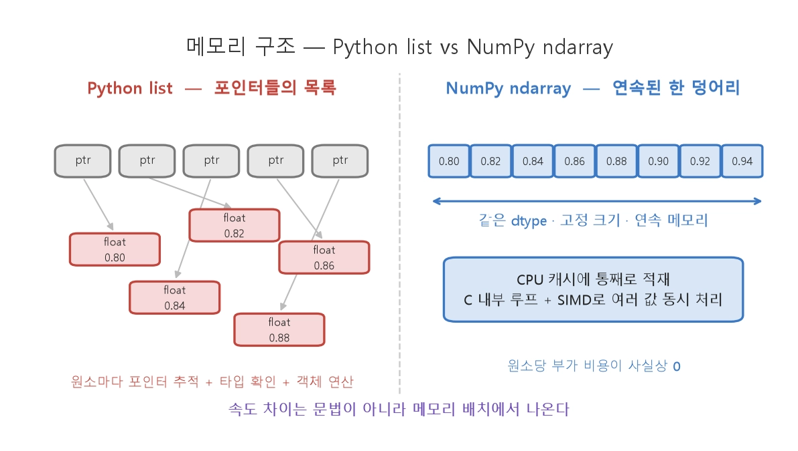
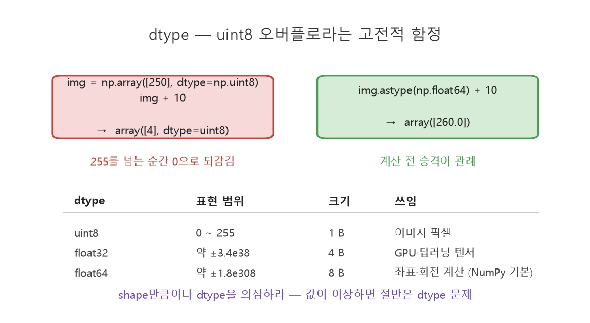
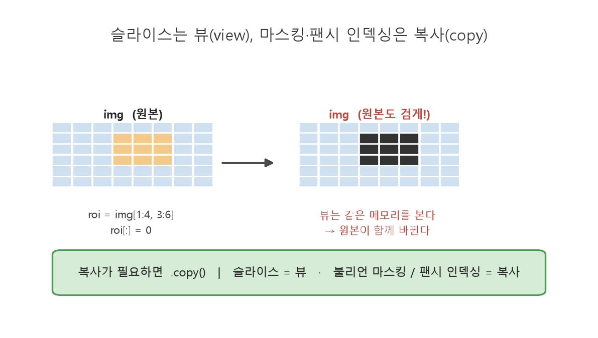
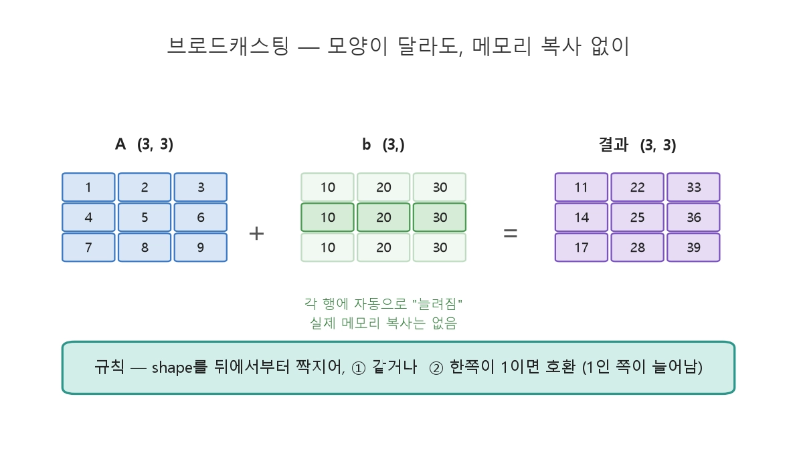

# numpy

## ndarray는 왜 빠를까
1. Numpy 중심객체는 ndarray(n-dimension array)
2. list와 차이는 문법이 아닌 메모리 구조
3. 
4. Python list는 포인터들의 목록 - 반복문이 원소마다 "포인터 따라가기+타입확인+객체연산"을 반복
5. ndarray는 같ㅇ튼 타입(dtype)의 값이 연속된 한덩어리 - CPU 캐시에 올라가고 C로 구현된 내부 루프가 SIMD명령으로 여러값을 한꺼번에 처리
6. SIMD는 Single Instruction, Multiple Data의 약자로, 우리말로는 ‘단일 명령 다중 데이터’라고 합니다. - 하나의 명령어로 여러 개의 데이터를 동시에(병렬로) 처리하는 기술\
7. 같은 계산이 Python 반복문 대비 NumPy 벡터화에서 수십 배(이 실측에서는 약 56배) 빠릅니다. 30Hz 인지 루프처럼 마감이 있는 코드에서 이 차이는 "동작하는 시스템"과 "마감을 놓치는 시스템"의 차이입니다

## 기본기

1.**shape**는 NumPy 사고의 중심입니다. 로봇 데이터의 전형적인 shape를 기억해 두세요.

LiDAR 1스캔	(360,)	각도별 거리
위치 궤적	(N, 3)	N개 시점 × (x, y, z)
회전 행렬	(3, 3)	3차원 회전 (모듈 ② TF2와 연결)
컬러 이미지	(H, W, 3)	높이 × 너비 × RGB

axis(축)는 "어느 방향으로 연산할지"입니다.

`(N, 3)` 궤적에서 코드로 확인하면:

```python
traj = np.array([[0.0, 0.0, 0.0],
                 [0.5, 0.1, 0.0],
                 [1.0, 0.3, 0.0]])   # shape (3, 3): 시점 3개 × 좌표 3

traj.mean(axis=0)    # 시점 방향으로 평균 → 좌표별 평균 위치, shape (3,)
traj.mean(axis=1)    # 좌표 방향으로 평균 → 시점별 평균(의미 없음 예시), shape (3,)
```

<aside>
💡

**axis=k는 "k번째 차원을 붕괴시킨다"** 로 읽으면 헷갈리지 않습니다. `(3, 3)`에서 `axis=0`을 붕괴 → `(3,)`.

</aside>



해석: 이미지 픽셀은 보통 uint8(0~255, 1바이트), 좌표 계산은 float64(8바이트)입니다. uint8끼리 더하면 255를 넘는 순간 오버플로가 나서 250+10이 4가 됩니다. 계산 전 img.astype(np.float64) 로 승격하는 것이 관례입니다. shape만큼이나 dtype을 의심하라 — 값이 이상할 때 절반은 dtype 문제입니다.

## 슬라이싱
리스트처럼 [시작:끝:간격]으로 자르되, 차원마다 콤마로 지정합니다.

```python
scan = np.random.rand(360) * 10       # LiDAR 스캔 (0~10m)

scan[0:90]        # 전방 90° 구간
scan[::2]         # 한 칸 걸러 다운샘플링
scan[-10:]        # 마지막 10개

img = np.random.rand(480, 640, 3)
img[100:200, 300:400]     # 이미지의 관심 영역(ROI) 잘라내기
img[:, :, 0]              # R 채널만 → shape (480, 640)
img[::2, ::2]             # 가로세로 절반 해상도로 다운샘플
```

여기서 NumPy의 중요한 성질 — **슬라이스는 복사가 아니라 뷰(view)** 입니다.



해석: 슬라이스로 잘라낸 ROI는 원본과 같은 메모리를 가리킵니다. ROI를 검게 칠하면 원본 이미지의 그 영역도 검게 변합니다. 대용량 데이터를 복사 없이 다루게 해 주는 강력한 기능이지만, 모르고 쓰면 "원본이 왜 바뀌지?" 버그가 됩니다.

- ROI는 Region of Interest의 약자로, 의미: 전체 이미지나 데이터에서 분석·처리하고 싶은 특정 부분(영역)을 의미합니다.

핵심 역할: 전체 데이터를 다 처리하지 않고 필요한 부분만 잘라내어 연산함으로써 메모리를 절약하고 처리 속도를 대폭 향상시킵니다.

### 불리언 마스킹 — 조건으로 골라내기

벡터화의 꽃입니다. 조건식이 **True/False 배열(마스크)** 을 만들고, 그 마스크로 원소를 선택합니다.

**해석**: `scan < 1.0` 이라는 조건식 하나가 원본과 같은 길이의 **True/False 배열**을 만들고, 그 배열을 인덱스 자리에 넣으면 True인 원소만 남습니다. **조건 → 마스크 → 선택**이라는 세 박자가 벡터화 사고의 기본형입니다.

```python
scan = np.array([0.3, 8.2, 0.5, 12.0, 0.45, 9.9])

mask = scan < 1.0          # array([True, False, True, False, True, False])
near = scan[mask]          # array([0.3, 0.5, 0.45]) — 1m 이내 장애물만
scan[scan > 10.0] = 10.0   # 10m 초과 값을 10으로 클리핑 (센서 최대거리 처리)

# 복합 조건: & (and), | (or) — 괄호 필수!
valid = scan[(scan > 0.1) & (scan < 10.0)]   # 유효 측정만
```

반복문으로 쓰면 5줄+조건분기가 될 코드가 한 줄이 되고, 속도는 수십 배 빠릅니다. LiDAR 노이즈 제거, 이미지 임계값 처리(픽셀 밝기 > 128인 곳만) 등 인지 코드의 표준 관용구입니다.

- 시 인덱싱과 np.where
    
    인덱스 **배열**로 원소를 골라낼 수도 있습니다(팬시 인덱싱).
    
    ```python
    idx = np.array([0, 2, 4])
    scan[idx]                        # 0, 2, 4번 원소 → 복사본 반환 (뷰 아님!)
    
    np.where(scan < 1.0)             # 조건을 만족하는 인덱스들
    np.where(scan < 1.0, 0.0, scan)  # 조건부 치환: 1m 미만이면 0, 아니면 원래 값
    np.argmin(scan)                  # 최솟값의 위치 — "가장 가까운 장애물이 몇 번째 각도인가"
    ```
    
    슬라이스는 뷰, 팬시 인덱싱·마스킹은 **복사**라는 차이도 기억해 두세요.

    ## 브로드캐스팅
    shape가 같은 배열끼리는 원소별 연산이 자명합니다. NumPy는 여기서 한 발 더 나가, 모양이 다른 배열 간의 연산 규칙을 제공합니다.

    
    **해석**: `(3,3)` 행렬에 `(3,)` 벡터를 더하면, 벡터가 각 행에 **자동으로 "늘려져"** 적용됩니다. 중요한 것은 이 늘림이 **실제 메모리 복사 없이** 일어난다는 점 — 큰 배열을 만들지 않고도 같은 효과를 냅니다.

**규칙은 두 줄**입니다. 두 배열의 shape를 **뒤에서부터** 짝지어 비교해서:

1. 두 크기가 **같거나**,
2. **한쪽이 1이면** → 호환 (1인 쪽이 상대 크기로 늘어남)

모든 짝이 호환이면 연산 가능, 아니면 에러입니다.

```python
A = np.random.rand(480, 640, 3)   # 이미지
m = np.array([0.5, 1.0, 2.0])     # 채널별 계수, shape (3,)

A * m
# A:  (480, 640, 3)
# m:  (          3)   ← 뒤에서부터: 3=3 ✓, 나머지는 m에 차원이 없으므로 자동 확장
# 결과: (480, 640, 3) — R×0.5, G×1.0, B×2.0 이 한 줄로!
```

로봇에서 자주 쓰는 패턴들:

```python
# ① 궤적 전체를 원점 이동: (N,3) - (3,)
traj_centered = traj - traj[0]

# ② 궤적 전체 회전: (3,3) 행렬 @ (N,3) → 행렬곱 + 전치 관용구
R = np.array([[0, -1, 0], [1, 0, 0], [0, 0, 1]])   # z축 90° 회전
traj_rot = traj @ R.T                              # (N,3) — N개의 점을 한 번에 회전!

# ③ 스칼라도 브로드캐스팅: 모든 거리값을 mm → m
scan_m = scan_mm * 0.001
```

②번이 특히 중요합니다 — 모듈 ②의 TF2 좌표 변환, Level 2의 기구학이 전부 "점들의 배열 × 회전 행렬"이며, NumPy에서는 반복문 없이 `@` 하나로 끝납니다.

- **심화** — 차원 추가(newaxis)로 브로드캐스팅 설계하기
    
    `(N,)` 벡터와 `(M,)` 벡터의 **모든 조합**(N×M)을 계산하고 싶다면, 한쪽에 길이 1의 차원을 삽입합니다.
    
    ```python
    a = np.array([1, 2, 3])          # (3,)
    b = np.array([10, 20])           # (2,)
    
    a[:, np.newaxis] + b             # (3,1) + (2,) → (3,2): 모든 합 조합
    # [[11, 21],
    #  [12, 22],
    #  [13, 23]]
    ```
    
    응용: 로봇 위치 `(2,)`와 장애물들 `(N, 2)` 사이의 거리를 한 번에 —
    
    images/06_newaxis_거리.png — 최근접 장애물 브로드캐스팅
    
    <aside>
    💡
    
    **해석**: `(N,2) - (2,)` 는 뒤에서부터 짝지어 `2=2`로 일치하므로 앞 차원이 자동 확장되어 `(N,2)` 차이 배열이 됩니다. 여기에 `axis=1` 합과 `argmin`을 얹으면 최근접 장애물 탐색이 세 줄로 끝납니다.
    
    </aside>
    
    ```python
    diff = obstacles - robot_pos               # (N,2) - (2,) → (N,2)
    dists = np.sqrt((diff**2).sum(axis=1))     # (N,) — N개 거리를 반복문 없이
    nearest = obstacles[np.argmin(dists)]      # 가장 가까운 장애물
    ```
    
    이 세 줄이 "주변 장애물 중 최근접 찾기"의 완성형 벡터화 코드입니다.

    벡터화 전환의 일반 공식:
| 반복문 패턴 | 벡터화 대응 |
| --- | --- |
| 원소마다 계산 | 배열 전체 연산 (`a*2`, `np.sin(a)`) |
| if로 걸러서 모으기 | 불리언 마스킹 (`a[cond]`) |
| if로 값 바꾸기 | `np.where(cond, x, y)` 또는 `a[cond] = x` |
| 합·평균·최대 구하기 | `sum()`, `mean()`, `max()` (+ axis) |
| 두 배열 짝지어 계산 | 같은 shape 연산 또는 브로드캐스팅 |
| 최솟값의 "위치" 찾기 | `np.argmin`, `np.argmax` |

이 표만 체득해도 인지·제어 데이터 처리 코드의 90%를 벡터화할 수 있습니다. 그리고 이 감각은 모듈 ④의 제어 시뮬레이션(시간축 배열 연산)과 이후 PyTorch(문법이 NumPy와 거의 동일)로 그대로 이어집니다.